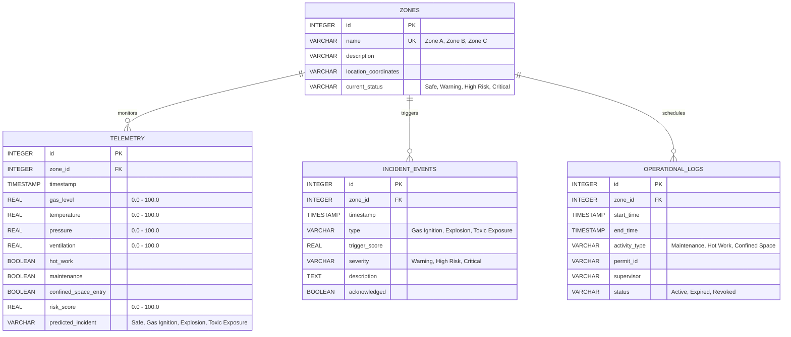

# Foresight

## Predictive Industrial Risk Intelligence Platform

### Tagline
See Risk Before It Becomes Reality.

---
## Overview
Foresight is an AI-powered industrial risk intelligence platform designed to predict dangerous compound-risk conditions before they escalate into incidents.
The platform is built for oil and gas refinery environments where multiple operational and environmental signals must be continuously monitored to ensure worker safety and operational continuity.
Unlike traditional safety systems that react to isolated alarms, Foresight identifies hazardous combinations of conditions across sensors and operational activities.

---
## The Problem
Industrial facilities already generate large amounts of safety-related data:
- Gas sensors
- Pressure sensors
- Temperature sensors
- Ventilation systems
- Permit-to-work systems
- Maintenance activities
Despite this data availability, incidents continue to occur because risk signals remain fragmented across disconnected systems. A single signal may not indicate danger. However, multiple signals occurring simultaneously may indicate a critical safety threat. Current systems rarely detect these compound-risk scenarios.
---
## Our Solution
Foresight acts as an intelligence layer above existing industrial systems. It continuously evaluates sensor readings and operational activities to identify dangerous combinations that may lead to:
- Gas Ignition
- Explosion
- Toxic Exposure
The platform then provides:
- Risk scores
- Incident predictions
- Contributing factors
- Recommended actions
- AI-powered safety explanations
---
## Core Innovation
Traditional safety systems detect individual hazards. Foresight detects compound risks.
**Example:**
$$\text{High Gas Levels} + \text{Active Hot Work Permit} + \text{Reduced Ventilation} = \text{Potential Gas Ignition Event}$$
No individual system would identify this relationship independently. Foresight connects fragmented signals into actionable foresight.

---
## Key Features
### Compound Risk Intelligence Engine
Analyzes:
- Gas Levels
- Temperature
- Pressure
- Ventilation
Operational Activities:
- Hot Work Permit
- Maintenance Activity
- Confined Space Entry
Produces:
- Risk Score
- Severity Classification
- Predicted Incident
### Incident Prediction
Predicts:
- Gas Ignition
- Explosion
- Toxic Exposure
Before escalation occurs.
### AI Safety Analyst
Natural-language industrial safety assistant capable of:
- Explaining risk scores
- Identifying contributing factors
- Recommending actions
- Summarizing incidents
### Industrial Dashboard
Provides:
- Zone Monitoring
- Event Timeline
- Risk Overview
- Incident Investigation
---
## Technology Stack
**Frontend**
- React
- Vite
- TailwindCSS
**Backend**
- FastAPI
- Python
**AI**
- Gemini API
**Machine Learning**
- Scikit-Learn
**Database**
- SQLite
**Deployment**
- Vercel (Frontend)
- Render (Backend)
---
## Repository Directory Tree
Below is the directory structure designed for Foresight. It separates concerns, ensures clean modularity for frontend, backend, and machine learning components, and holds comprehensive documentation.
```
foresight/
├── README.md                           # Project homepage & developer guide
├── architecture.md                     # High-level architecture and system flow
├── product-spec.md                     # Detailed product specifications and MVP scope
├── frontend/                           # React SPA dashboard codebase
│   ├── README.md                       # Frontend README (setup, run, structure)
│   └── src/                            # React application source code (placeholder)
├── backend/                            # FastAPI + SQLite API codebase
│   ├── README.md                       # Backend README (setup, run, structure)
│   └── app/                            # Backend source code modules (placeholder)
├── dataset/                            # Dataset and generation scripts
│   ├── README.md                       # Dataset overview and setup
│   └── dataset-spec.md                 # Technical specification of the dataset
├── docs/                               # General project documentation
│   ├── README.md                       # Documentation index
│   ├── api-spec.md                     # REST API Endpoint specifications
│   └── deployment-guide.md             # Render/Vercel/SQLite setup guide
├── architecture/                       # Deep-dive architectural blueprints
│   ├── README.md                       # Architecture blueprints index
│   └── risk-engine-design.md           # Formulas & logic of Compound Risk Engine
├── presentation/                       # Presentation & pitch materials
│   └── README.md                       # Hackathon pitch outline and script
├── config/                             # Configuration files and templates
│   ├── README.md                       # Environment management guidelines
│   └── .env.example                    # Template environment variables
└── tests/                              # Testing directory
    ├── README.md                       # General test suite specifications
    ├── frontend/                       # Frontend component/routing tests
    ├── backend/                        # API integration and service tests
    └── risk_engine/                    # Unit tests for risk validation math
```
---
## Directory Descriptions
### 1. [frontend/](file:///c:/Users/saumy/projects/Foreshight/foresight/frontend)
*   **Purpose:** Houses the user interface layer of Foresight—the Industrial Dashboard.
*   **What Belongs Here:** React SPA built with Vite and TailwindCSS, including components (Zone views, Event Timeline, AI Chat interface), assets, state hooks, and client services.
*   **Why It Exists:** Separates presentation and client-side interactions from core backend processing, allowing simple frontend deployment on Vercel and modular dashboard development.
### 2. [backend/](file:///c:/Users/saumy/projects/Foreshight/foresight/backend)
*   **Purpose:** Contains the core server API, database schemas, and AI integration services.
*   **What Belongs Here:** FastAPI app code, database connection modules, ML inference loaders, Gemini client integrations, schemas, and routes.
*   **Why It Exists:** Centralizes the system's business logic, telemetry processing, database persistent storage, and Gemini API endpoints, ensuring security and backend testing isolation.
### 3. [dataset/](file:///c:/Users/saumy/projects/Foreshight/foresight/dataset)
*   **Purpose:** Holds synthetic refinery data assets and documentation.
*   **What Belongs Here:** Specifications describing data fields (`dataset-spec.md`), generator script files, and generated safety dataset output files.
*   **Why It Exists:** Segregates training data engineering processes from application runtimes, providing a clear history of dataset parameters and rules.
### 4. [docs/](file:///c:/Users/saumy/projects/Foreshight/foresight/docs)
*   **Purpose:** Houses the project documentation library.
*   **What Belongs Here:** API descriptions (`api-spec.md`), deployment checklists (`deployment-guide.md`), and API documentation files.
*   **Why It Exists:** Serves as a single source of truth for the interfaces, configurations, and administrative plans, allowing clean onboarding for engineers.
### 5. [architecture/](file:///c:/Users/saumy/projects/Foreshight/foresight/architecture)
*   **Purpose:** Houses deep-dive architecture specs and mathematical details.
*   **What Belongs Here:** The Compound Risk Engine calculation design, logic models, and rulesets (`risk-engine-design.md`).
*   **Why It Exists:** Establishes rigorous mathematical and functional definitions of the platform's core intellectual property before implementation.
### 6. [presentation/](file:///c:/Users/saumy/projects/Foreshight/foresight/presentation)
*   **Purpose:** Organizes hackathon presentation artifacts.
*   **What Belongs Here:** Slide pitch outlines, demonstration scripts, video walkthrough descriptions, and judges' overview guidelines.
*   **Why It Exists:** Streamlines pitch planning for non-technical team members and separates marketing/demo prep from backend code.
### 7. [config/](file:///c:/Users/saumy/projects/Foreshight/foresight/config)
*   **Purpose:** Manages configuration blueprints and deployment settings.
*   **What Belongs Here:** Example environmental files (`.env.example`), global parameters, and format profiles.
*   **Why It Exists:** Prevents sensitive secrets from leaking into Git repositories and enforces standardized environments.
### 8. [tests/](file:///c:/Users/saumy/projects/Foreshight/foresight/tests)
*   **Purpose:** Houses the quality assurance code tests.
*   **What Belongs Here:** Unit and integration tests targeting FastAPI routing, React components, and Risk Engine functions.
*   **Why It Exists:** Guarantees that modifications do not break existing features, enabling continuous validation.
---
## Naming Conventions
To maintain codebase readability and consistency across components:
*   **Python Files:** Snake case (e.g., `risk_engine.py`, `sensor_model.py`).
*   **React Components:** Pascal case (e.g., `ZonePanel.jsx`, `AlertCard.jsx`).
*   **Helper JS/JSX Files:** Camel case (e.g., `useTelemetry.js`, `apiClient.js`).
*   **Directories:** Lowercase with hyphens if multi-word (e.g., `risk-engine/`, `api-routes/`).
*   **Database Tables:** Lowercase plural with snake case (e.g., `sensor_records`, `safety_alerts`).
*   **API Routes:** Kebab case, versioned (e.g., `/api/v1/risk-assessment`, `/api/v1/zones/status`).
*   **Variables/Functions:** camelCase in JavaScript; snake_case in Python.
*   **Classes:** PascalCase in Python and JavaScript.
---
## Development Workflow
We follow an Agile Git Flow model to enable concurrent frontend and backend work:
1.  **Local Environment Config:** Copy `config/.env.example` to `backend/.env` (and `frontend/.env` if client-side parameters exist). Set up keys.
2.  **Database Seeding:** Run the generator pipeline to build the synthetic CSV, then run db scripts to initialize and load the SQLite tables.
3.  **Local API Server Launch:** Start python virtual environment, install requirements, run `uvicorn main:app --reload` from backend.
4.  **Local Dashboard Launch:** Navigate to frontend, run `npm install` and `npm run dev`.
5.  **Branching Strategy:** Cut specific feature branches (e.g., `feature/ai-chat-interface`) from `dev`, issue PRs with tests, and merge only after local verification.
---
## MVP Implementation Roadmap
To deliver the hackathon MVP efficiently, we will execute development in 5 clear milestones:
1.  **Milestone 1: Data Engine (Dataset & Generation)**
    *   Implement data schema specifications (`dataset-spec.md`).
    *   Build generator script to export `synthetic_refinery_dataset.csv` with 10,000 safety scenarios.
    *   Verify distributions and target compound risk anomalies.
2.  **Milestone 2: Backend Infrastructure**
    *   Setup FastAPI app, link SQLite database with SQLAlchemy/SQLModel.
    *   Build schemas and tables for Zones (Zone A, B, C), events, and risk telemetry.
    *   Expose endpoints for storing sensor readings.
3.  **Milestone 3: Risk Engine & ML Prediction**
    *   Implement logical compound check conditions in code.
    *   Expose API endpoints that return risk predictions and scores dynamically.
    *   Integrate model inference (scikit-learn) to predict incident likelihood.
4.  **Milestone 4: Industrial UI Dashboard**
    *   Scaffold React, Vite, and TailwindCSS application.
    *   Design Zone Monitoring layout with risk severity indicator badges (Safe, Warning, High, Critical).
    *   Create Event Timeline stream showing real-time risk occurrences.
5.  **Milestone 5: AI Safety Analyst & Integration**
    *   Set up FastAPI integration with Gemini API to analyze current zone sensor status.
    *   Create interactive AI panel on UI for natural-language inquiry.
    *   Execute end-to-end local runs and deploy services.
---
## Future Scope
- Real IoT Integration
- SCADA Integration
- Computer Vision Safety Monitoring
- Worker Location Intelligence
- Digital Twin Simulation
- Automated Emergency Response
# Foresight Architecture Blueprint
## System Overview
Foresight is a predictive industrial risk intelligence platform designed to identify compound-risk scenarios within oil and gas refinery environments. The system combines environmental sensor readings and operational activities to proactively identify potential industrial incidents.
By correlating physical sensor metrics (gas levels, temperature, pressure, ventilation) with operational data (hot work permits, active maintenance, confined space entry), the platform computes real-time risk scores and predicts incident categories before they trigger physical alarms.
---
## High-Level Architecture Diagram
The system employs a decoupled, asynchronous model-view-controller paradigm suited for modern web applications.
```mermaid
graph TD
    subgraph Client Layer (Vercel)
        UI[React Dashboard UI]
        Chat[AI Safety Analyst Chatbox]
    end
    subgraph Service API Layer (Render / FastAPI)
        API[FastAPI Gateway]
        RE[Compound Risk Engine]
        ML[Incident Predictor - Scikit-Learn]
        AI[AI Analyst Service - Gemini SDK]
    end
    subgraph Storage Layer (SQLite)
        DB[(SQLite Database)]
    end
    subgraph Telemetry Source (Synthetic)
        Gen[Dataset Generator / Simulator]
    end
    Gen -->|Telemetry Ingestion API| API
    UI -->|API Requests / Stream| API
    Chat -->|Natural Language Prompt| API
    API --> RE
    API --> ML
    API --> AI
    RE --> DB
    ML --> DB
    AI -->|Prompt Context Synthesis| DB
    API --> DB
```
---
## Data Ingestion & Risk Evaluation Flow
1.  **Telemetry Transmission:** Sensor streams (gas levels, temperature, pressure, ventilation) and activity logs (hot work, maintenance, confined space entry) from zones are transmitted via HTTP POST to the backend ingest route.
2.  **Engine Evaluation:** The **Compound Risk Engine** receives the payload:
    *   Applies deterministic safety limit logic.
    *   Calculates a normalized, continuous `risk_score` (0-100).
    *   Tags the event if conditions trigger a known safety warning.
3.  **Predictive Model Evaluation:** The payload is fed into a lightweight **Scikit-Learn Classifier** model. This model outputs an incident likelihood vector for `Gas Ignition`, `Explosion`, `Toxic Exposure`, and `Safe`.
4.  **Database Storage:** The telemetry reading, computed risk score, prediction outputs, and any active warnings are written to the database.
5.  **State Broadcast:** The UI dashboard receives updated risk statuses for each zone.
6.  **AI Analyst Loop:** Operators can query the **AI Safety Analyst**. The analyst fetches context from the database (recent zone trends, active permits, risk engine metrics) and crafts a prompt for the Gemini API to explain the anomaly and suggest safety actions.
---
## Database Schema (SQLite)
We use an optimized relational SQLite database schema. It supports time-series telemetry data, operational log events, and zone configuration.

---
## Machine Learning Pipeline Design
The platform implements a predictive pipeline to model and classify industrial risk.
### 1. Training Phase
*   **Offline Ingestion:** Reads training samples from `synthetic_refinery_dataset.csv`.
*   **Features:** `[gas_level, temperature, pressure, ventilation, hot_work, maintenance, confined_space_entry]`
*   **Target Label:** `incident_type` (Multiclass classification: `Safe`, `Gas Ignition`, `Explosion`, `Toxic Exposure`)
*   **Model:** A `RandomForestClassifier` or `GradientBoostingClassifier` implemented via Scikit-Learn.
*   **Artifact Serialization:** Saves the trained model to `backend/app/ml/models/safety_classifier.joblib`.
### 2. Inference Phase
*   **Execution:** On telemetry ingestion, the API retrieves the serialized `.joblib` model.
*   **Prediction:** Runs `model.predict_proba(features)` to obtain probabilities for each classification.
*   **Output:** Maps values to the database and raises incident alarms if the probability of any hazard exceeds defined safety limits (e.g. > 70%).
---
## AI Safety Analyst (Gemini API Integration)
The **AI Safety Analyst** provides safety operators with natural-language interpretations of current risk profiles, explaining the underlying causes of alarms.
```
       +-----------------------+
       |   User Safety Query   |
       +-----------+-----------+
                   |
                   v
  +---------------------------------+
  | FastAPI Context Collector:      |
  | - Query SQLite for target zone  |
  | - Gather last 10 telemetry logs |
  | - Fetch active work permits     |
  | - Retrieve Risk Engine metrics  |
  +-----------------+---------------+
                    |
                    v
     +------------------------------+
     | Prompt Orchestrator:         |
     | Formats context using strict  |
     | safety analyst guidelines    |
     +--------------+---------------+
                    |
                    v
    +-------------------------------+
    |   Gemini API Call             |
    |   (gemini-1.5-flash)          |
    +---------------+---------------+
                    |
                    v
     +------------------------------+
     | Safety-focused Markdown      |
     | response returned to UI      |
     +------------------------------+
```
### System Instruction & Constraints:
*   **Role:** The AI acts as a Senior Oil & Gas Refinery Safety Engineer.
*   **Focus:** Answers must prioritize human life, chemical safety codes, and incident mitigation guidelines.
*   **Scope:** The AI will not answer questions unrelated to refinery safety. It will refuse instructions to alter actual telemetry inputs or override physical alarms.
