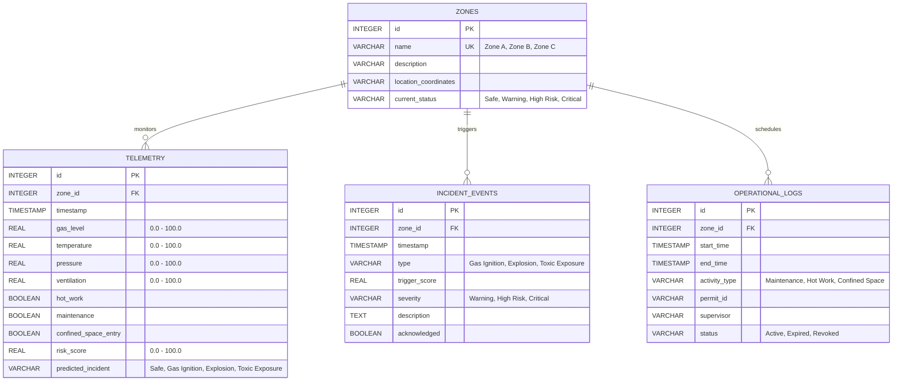

# Foresight Architecture Blueprint
## System Overview
Foresight is a predictive industrial risk intelligence platform designed to identify compound-risk scenarios within oil and gas refinery environments. The system combines environmental sensor readings and operational activities to proactively identify potential industrial incidents.
By correlating physical sensor metrics (gas levels, temperature, pressure, ventilation) with operational data (hot work permits, active maintenance, confined space entry), the platform computes real-time risk scores and predicts incident categories before they trigger physical alarms.
---
## High-Level Architecture Diagram
The system employs a decoupled, asynchronous model-view-controller paradigm suited for modern web applications.
```mermaid
graph TD
    subgraph Client Layer (Vercel)
        UI[React Dashboard UI]
        Chat[AI Safety Analyst Chatbox]
    end
    subgraph Service API Layer (Render / FastAPI)
        API[FastAPI Gateway]
        RE[Compound Risk Engine]
        ML[Incident Predictor - Scikit-Learn]
        AI[AI Analyst Service - Gemini SDK]
    end
    subgraph Storage Layer (SQLite)
        DB[(SQLite Database)]
    end
    subgraph Telemetry Source (Synthetic)
        Gen[Dataset Generator / Simulator]
    end
    Gen -->|Telemetry Ingestion API| API
    UI -->|API Requests / Stream| API
    Chat -->|Natural Language Prompt| API
    API --> RE
    API --> ML
    API --> AI
    RE --> DB
    ML --> DB
    AI -->|Prompt Context Synthesis| DB
    API --> DB
```
---
## Data Ingestion & Risk Evaluation Flow
1.  **Telemetry Transmission:** Sensor streams (gas levels, temperature, pressure, ventilation) and activity logs (hot work, maintenance, confined space entry) from zones are transmitted via HTTP POST to the backend ingest route.
2.  **Engine Evaluation:** The **Compound Risk Engine** receives the payload:
    *   Applies deterministic safety limit logic.
    *   Calculates a normalized, continuous `risk_score` (0-100).
    *   Tags the event if conditions trigger a known safety warning.
3.  **Predictive Model Evaluation:** The payload is fed into a lightweight **Scikit-Learn Classifier** model. This model outputs an incident likelihood vector for `Gas Ignition`, `Explosion`, `Toxic Exposure`, and `Safe`.
4.  **Database Storage:** The telemetry reading, computed risk score, prediction outputs, and any active warnings are written to the database.
5.  **State Broadcast:** The UI dashboard receives updated risk statuses for each zone.
6.  **AI Analyst Loop:** Operators can query the **AI Safety Analyst**. The analyst fetches context from the database (recent zone trends, active permits, risk engine metrics) and crafts a prompt for the Gemini API to explain the anomaly and suggest safety actions.
---
## Database Schema (SQLite)
We use an optimized relational SQLite database schema. It supports time-series telemetry data, operational log events, and zone configuration.

---
## Machine Learning Pipeline Design
The platform implements a predictive pipeline to model and classify industrial risk.
### 1. Training Phase
*   **Offline Ingestion:** Reads training samples from `synthetic_refinery_dataset.csv`.
*   **Features:** `[gas_level, temperature, pressure, ventilation, hot_work, maintenance, confined_space_entry]`
*   **Target Label:** `incident_type` (Multiclass classification: `Safe`, `Gas Ignition`, `Explosion`, `Toxic Exposure`)
*   **Model:** A `RandomForestClassifier` or `GradientBoostingClassifier` implemented via Scikit-Learn.
*   **Artifact Serialization:** Saves the trained model to `backend/app/ml/models/safety_classifier.joblib`.
### 2. Inference Phase
*   **Execution:** On telemetry ingestion, the API retrieves the serialized `.joblib` model.
*   **Prediction:** Runs `model.predict_proba(features)` to obtain probabilities for each classification.
*   **Output:** Maps values to the database and raises incident alarms if the probability of any hazard exceeds defined safety limits (e.g. > 70%).
---
## AI Safety Analyst (Gemini API Integration)
The **AI Safety Analyst** provides safety operators with natural-language interpretations of current risk profiles, explaining the underlying causes of alarms.
```
       +-----------------------+
       |   User Safety Query   |
       +-----------+-----------+
                   |
                   v
  +---------------------------------+
  | FastAPI Context Collector:      |
  | - Query SQLite for target zone  |
  | - Gather last 10 telemetry logs |
  | - Fetch active work permits     |
  | - Retrieve Risk Engine metrics  |
  +-----------------+---------------+
                    |
                    v
     +------------------------------+
     | Prompt Orchestrator:         |
     | Formats context using strict  |
     | safety analyst guidelines    |
     +--------------+---------------+
                    |
                    v
    +-------------------------------+
    |   Gemini API Call             |
    |   (gemini-1.5-flash)          |
    +---------------+---------------+
                    |
                    v
     +------------------------------+
     | Safety-focused Markdown      |
     | response returned to UI      |
     +------------------------------+
```
### System Instruction & Constraints:
*   **Role:** The AI acts as a Senior Oil & Gas Refinery Safety Engineer.
*   **Focus:** Answers must prioritize human life, chemical safety codes, and incident mitigation guidelines.
*   **Scope:** The AI will not answer questions unrelated to refinery safety. It will refuse instructions to alter actual telemetry inputs or override physical alarms.
